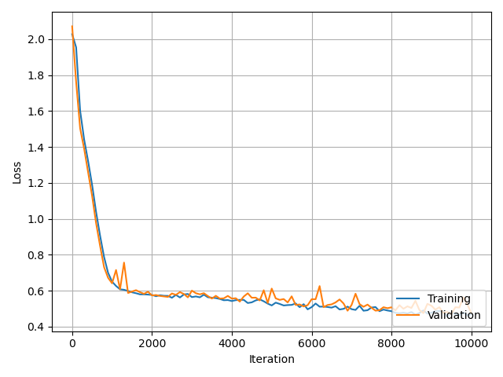
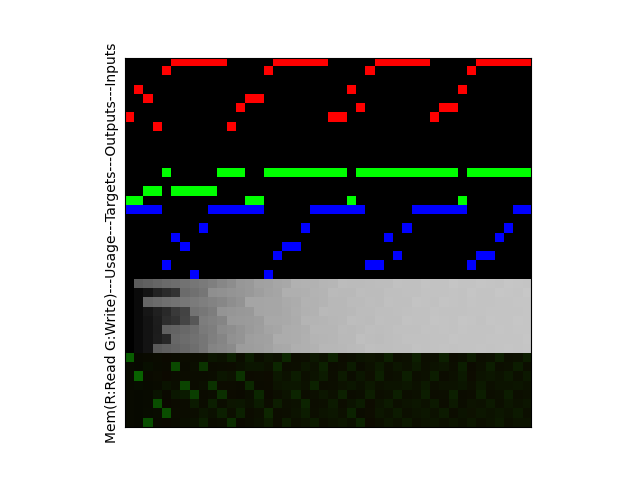
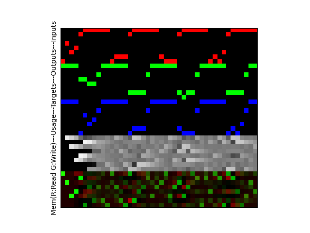

# Differential Neural Computer

A Differential Neural Computer (DNC) implementation.
Currently, it just learns to repeat back a series of patterns.

To Run:
```bash
$ python DNC.py
```

During training, any visualizations will be exported to a local directory called:<br>`images/`

Learn more about DNC's [here](https://deepmind.com/blog/article/differentiable-neural-computers).

This DNC implementation and visualizations are based on [this implementation by Mostafa-Samir](https://github.com/Mostafa-Samir/DNC-tensorflow).

**Using:**
<br>`Tensorflow`

## Results

### Losses Over 10,000 Iterations:


### Memory View At Iteration 0:


### Memory View At Iteration 10,000:

